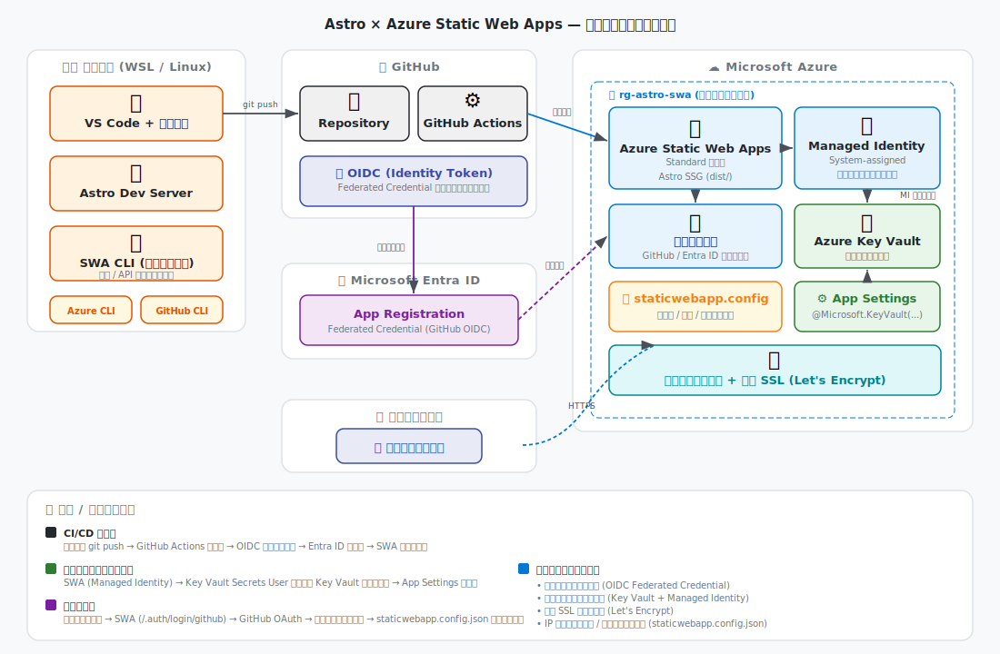

# Astro × Azure Static Web Apps ハンズオン

Astro フレームワークで構築した静的サイトを Azure Static Web Apps にデプロイするまでの一連の流れを、ステップバイステップで学べるハンズオンコンテンツです。

## アーキテクチャ



## 技術スタック

| カテゴリ | 技術 |
|---|---|
| フレームワーク | Astro (SSG) |
| ホスティング | Azure Static Web Apps (Standard) |
| CI/CD | GitHub Actions (OIDC 認証) |
| 認証 | SWA 組み込み認証 (GitHub / Entra ID) |
| シークレット管理 | Azure Key Vault + Managed Identity |
| 開発環境 | WSL (Linux) + VS Code |

## 前提条件

- Azure サブスクリプション
- GitHub アカウント
- Node.js v22.12.0 以上
- WSL (Ubuntu) + VS Code

## ドキュメント構成

### 設計ドキュメント

| ドキュメント | 内容 |
|---|---|
| [concept.md](concept.md) | コンテンツ設計書 (Phase 構成・スコープ定義) |
| [docs/architecture.md](docs/architecture.md) | アーキテクチャ設計書 (データフロー・セキュリティ設計) |

### ハンズオン (Phase 0〜7)

| Phase | ドキュメント | 内容 |
|---|---|---|
| **Phase 0** | [前提条件・環境準備](docs/phase-0-prerequisites.md) | WSL / Node.js / CLI / VS Code 拡張機能のセットアップ |
| **Phase 1** | [Astro プロジェクトの作成](docs/phase-1-astro-project.md) | スキャフォールド・ローカル開発・SWA CLI エミュレーション |
| **Phase 2** | [GitHub リポジトリのセットアップ](docs/phase-2-github-setup.md) | Git 初期化・リポジトリ作成・ブランチ戦略 |
| **Phase 3** | [Azure リソースの作成](docs/phase-3-azure-resources.md) | リソースグループ・SWA リソース (Standard) の作成 |
| **Phase 4** | [セキュリティ設定](docs/phase-4-security.md) | Managed Identity・Key Vault・OIDC Federated Credential・認証設定 |
| **Phase 5** | [CI/CD パイプラインの構成](docs/phase-5-cicd.md) | GitHub Actions ワークフロー (OIDC 方式) の作成 |
| **Phase 6** | [デプロイと動作検証](docs/phase-6-deploy-verify.md) | デプロイ実行・認証フロー検証・ステージング環境検証 |
| **Phase 7** | [運用・メンテナンス](docs/phase-7-operations.md) | カスタムドメイン・監視・トラブルシューティング・クリーンアップ |

## セキュリティのポイント

- **OIDC Federated Credential** — 長期デプロイトークン不要、短命トークンで GitHub Actions からセキュアにデプロイ
- **Managed Identity** — SWA → Key Vault へのパスワードレスアクセス (クレデンシャル管理不要)
- **Key Vault 参照** — `@Microsoft.KeyVault(...)` 構文でシークレットをコードに直書きしない
- **SWA 組み込み認証** — OAuth フローを自前実装せず、`staticwebapp.config.json` でルートベースの認可

## クイックスタート

```bash
# WSL に入る
wsl

# プロジェクトのクローン
git clone https://github.com/<YOUR_USERNAME>/astro_azure_swa.git
cd astro_azure_swa

# 依存関係のインストール
npm install

# ローカル開発サーバーの起動
npm run dev
# → http://localhost:4321

# SWA エミュレータ (認証込み) で起動
npm run build
swa start dist
# → http://localhost:4280
```

## 推奨 VS Code 拡張機能

| 拡張機能 | ID |
|---|---|
| WSL | `ms-vscode-remote.remote-wsl` |
| Astro | `astro-build.astro-vscode` |
| Azure Static Web Apps | `ms-azuretools.vscode-azurestaticwebapps` |
| Azure Account | `ms-vscode.azure-account` |
| Azure Resources | `ms-azuretools.vscode-azureresourcegroups` |
| GitHub Actions | `github.vscode-github-actions` |
| GitHub Pull Requests | `github.vscode-pull-request-github` |

## ライセンス

MIT
